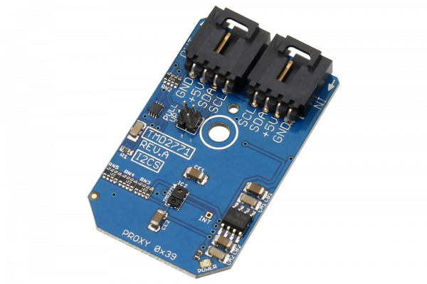

# TMD2771

The TMD2771 is a high sensitivity ambient light sensor (ALS) and proximity detector. The ALS has a dynamic range of up to 1,000,000:1, and is highly sensitive allowing it to work well in diverse lighting conditions, including behind dark glass. The proximity detection is calibrated to 100-mm detection.

This Device is available from www.ncd.io 

[SKU: TMD2771_I2CS]

(https://store.ncd.io/product/tmd2771-ambient-light-sensing-als-16-bit-proximity-detection-calibrated-to-100-mm-i2c-mini-module/)
This Sample code can be used with Arduino.

Hardware needed to interface TMD2771 sensor with Arduino

1. <a href="https://store.ncd.io/product/i2c-shield-for-arduino-nano/">Arduino Nano</a>

2. <a href="https://store.ncd.io/product/i2c-shield-for-arduino-micro-with-i2c-expansion-port/">Arduino Micro</a>

3. <a href="https://store.ncd.io/product/i2c-shield-for-arduino-uno/">Arduino uno</a>

4. <a href="https://store.ncd.io/product/dual-i2c-shield-for-arduino-due-with-modular-communications-interface/">Arduino Due</a>

5. <a href="https://store.ncd.io/product/tmd2771-ambient-light-sensing-als-16-bit-proximity-detection-calibrated-to-100-mm-i2c-mini-module/">TMD2771 Ambient Light Sensing 16Bit Proximity Detector Sensor</a>

6. <a href="https://store.ncd.io/product/i%C2%B2c-cable/">I2C Cable</a>

TMD2771:

The TMD2771 is a high sensitivity ambient light sensor (ALS) and proximity detector. The ALS has a dynamic range of up to 1,000,000:1, and is highly sensitive allowing it to work well in diverse lighting conditions, including behind dark glass. The proximity detection is calibrated to 100-mm detection.

Applications:

• Cell Phone Backlight Dimming

• Cell Phone Touch Screen Disable

• Notebook/Monitor Security

• Automatic Speakerphone Enable

• Automatic Menu Popup

How to Use the TMD2771 Arduino Library

The TMD2771 has a number of settings, which can be configured based on user requirements.
          
1.Accessing time setting:The following command is used to set the accessing time of TMD2771 sensor.

             tmd.setATime(ATIME_2_72MS);                 // Cycles: 1, Time: 2.72 ms Max Count: 1024
         
 2.Proximity Interrupt time:The following command is used to set the Proximity Interrupt time.
 
            tmd.setPTime(PTIME_2_72MS);                 // Cycles: 1, Time: 2.72 ms Max Count: 1023
            
3.Wait time:The following command is used to set the wait time for sensor.

            tmd.setWTime(WTIME_1);                      // Wait Time: 1, Time (WLONG = 0): 2.72 ms Time (WLONG = 1):  0.032 sec
           
4.Proximity drive:The following command is used to set the proximity drive.

            tmd.setProximityDrive(PDRIVE_100);          // LED Strength – PDL=0: 100%
           
5.Proximity diode selection:The following command is used for the selection of diode.             
           
            tmd.setProximityDiode(PDIODE_CH1);          // Proximity Uses the CH1 Diode
             
6.ALS Gain setting:The following command is used to set the ALS gain.             
             
            tmd.setALSGain(AGAIN_1X);                   // ALS Gain: 1X
             
